  

  
  
  
  

  

---

## What I actually do

I build the software travel companies run on — booking and reservation flows,
quoting, supplier integrations, and the operations systems that sit behind them.
Two of my travel CRMs are in production, running real businesses daily.

Before this, a year leading a team on Pakistan's federal e-procurement platform:
tenders, evaluations, contracts, payment gateway integration. A system that runs
statutory processes and cannot quietly be wrong. That is where most of what I
apply to booking systems came from.

I deliver client work through **[Codic Systems](https://codicsystems.com)**, a
registered software company in Islamabad.

<table>
<tr>
<td width="33%" valign="top">

### 🧭 Travel systems
Booking and reservation flows, quoting engines, fare and supplier API
integration, back-office operations.

</td>
<td width="33%" valign="top">

### 🔌 Integrations
Payment gateways, WhatsApp Business API, e-signature, accounting. The
interesting part is never the happy path.

</td>
<td width="33%" valign="top">

### 🤖 AI workflows
Extraction, routing and automation with n8n and the Claude API. The model
reads; a human owns any decision that creates an obligation.

</td>
</tr>
</table>

---

## Open source

Published through **[@codicsystems](https://github.com/codicsystems)** — the tools
and reference material we can share from client work.

| | |
|---|---|
| **[travel-whatsapp-booking-bot](https://github.com/codicsystems/travel-whatsapp-booking-bot)** | n8n workflow for inbound travel enquiries — extracts what a consultant needs, hands anything complex to a person. Verifies Meta's webhook signature, which most tutorials skip. |
| **[pk-it-export-toolkit](https://github.com/codicsystems/pk-it-export-toolkit)** | The paperwork Pakistani companies need when invoicing clients abroad. Templates, checklists, and the purpose-code problem explained. |
| **[redmoon-pdf](https://github.com/codicsystems/redmoon-pdf)** | Compress a PDF to an exact size, in the browser. No upload, no server, binary search over quality and scale. |
| **[travel-tech-learning-path](https://github.com/codicsystems/travel-tech-learning-path)** | How travel booking systems actually work, for engineers about to build one. |

---

<b>🧰 Stack — what I reach for, and when</b>

 

**Building the thing**

**Automation and AI**

**Honest note:** PHP and MySQL still carry most of my production work, because
the systems I maintain were built on them and rewrites rarely serve the client.
React and Node go on anything new with a real front end.

<b>⚙️ How I work</b>

 

- **Written specification before any code**, including an explicit list of what is *not* included
- **Architecture decision records** — one page per significant choice: what I decided, what I considered, why
- **Tests where being wrong costs money** — anything touching payments or bookings
- **A human review pass on every AI-generated module** — security boundaries, error handling, and anything the model may have invented
- **Handover pack** — README, environment setup, deployment steps, credentials, architecture diagram, known limitations

Fixed price against a defined outcome. I do not bill hours: when tooling cuts a
twenty-hour job to five, hourly billing punishes me for getting faster.

<b>🎓 And the part that surprises people</b>

 

I taught people to code for six years — 21 five-star reviews, including six
months getting a 52-year-old career changer through a bootcamp he had previously
failed.

It is why I can explain a technical decision to someone who does not write
software, which turns out to matter more on most projects than anything in the
stack section above.

---

  
    Two travel CRMs in production · A national e-procurement platform ·
    21 five-star teaching reviews 
    <a href="https://eservices.secp.gov.pk/eServices/NameSearch.jsp">Verify Codic Systems on the SECP register</a> — search <b>CODIC SYSTEMS</b>
  

---

  

