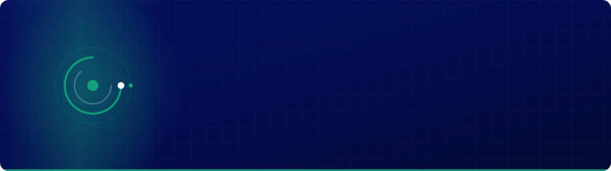

  

  
  
  
  

<h3 align="center">I build AI automation and custom business systems.</h3>

  Writing software professionally since 2019. 50+ travel websites, plus systems in healthcare, education, real estate and finance.

---

## What I do

I build software that takes manual work off a team's plate: AI agents and workflow automation, booking and operations systems, and the integrations that connect them. Travel CRMs I built are in production, and I have also built a multi-module hospital records system, an education ERP, and a certificate verification platform for an Albanian certification body.

Before going independent, I led a team on EPADS, Pakistan's federal e-procurement platform, delivered by Emenac under a government contract. Tenders, evaluations, contracts and payment gateway integration. It runs statutory processes and cannot quietly be wrong, and most of my habits around testing and audit trails come from there.

I deliver client work through **[Codic Systems](https://codicsystems.com)**, the software company I founded in Islamabad in August 2026.

<table>
<tr>
<td width="33%" valign="top">

### AI agents and automation
n8n and the Claude API for extraction, routing and workflows. The model reads and drafts. A person owns any decision that involves money or bookings.

</td>
<td width="33%" valign="top">

### Business systems
Booking and reservation flows, quoting, back office tools and dashboards. PHP and MySQL, or React and Node, depending on what the client already runs.

</td>
<td width="33%" valign="top">

### Integrations
Payment gateways, WhatsApp Business API, e-signature, accounting and supplier APIs. The interesting part is never the happy path.

</td>
</tr>
</table>

---

## Open source

Published through **[@codicsystems](https://github.com/codicsystems)**. These are tools and reference material that came out of real work.

| | |
|---|---|
| **[travel-whatsapp-booking-bot](https://github.com/codicsystems/travel-whatsapp-booking-bot)** | n8n workflow for inbound WhatsApp enquiries. Extracts what a consultant needs, replies to fill the gaps, and hands anything complex to a person. Verifies Meta's webhook signature, which most tutorials skip. |
| **[pk-it-export-toolkit](https://github.com/codicsystems/pk-it-export-toolkit)** | The paperwork Pakistani companies need when invoicing clients abroad. Templates, checklists, and the purpose code problem explained. |
| **[redmoon-pdf](https://github.com/codicsystems/redmoon-pdf)** | Compress a PDF to an exact size, in the browser. No upload, no server, binary search over quality and scale. |
| **[travel-tech-learning-path](https://github.com/codicsystems/travel-tech-learning-path)** | How booking and operations systems actually work, for engineers about to build one. |

---

<b>Stack: what I reach for, and when</b>

 

**Building the thing**

**Automation and AI**

**Honest note:** PHP and MySQL still carry most of my production work, because the systems I maintain were built on them and rewrites rarely serve the client. React and Node go on anything new with a real front end.

<b>How I work</b>

 

- **Written specification before any code**, including an explicit list of what is *not* included
- **Architecture decision records**, one page per significant choice: what I decided, what I considered, why
- **Tests where being wrong costs money**, meaning anything touching payments or bookings
- **A human review pass on every AI-generated module** for security boundaries, error handling, and anything the model may have invented
- **Handover pack** with README, environment setup, deployment steps, credentials, architecture diagram, known limitations

Fixed price against a defined outcome. I do not bill hours: when tooling cuts a twenty hour job to five, hourly billing punishes me for getting faster.

<b>Teaching, and why it matters</b>

 

I taught people to code for six years and hold 21 five-star reviews for it, including six months spent getting a 52 year old career changer through a bootcamp he had previously failed.

It is why I can explain a technical decision to someone who does not write software, which turns out to matter more on most projects than anything in the stack section above.

---

  
    50+ travel websites · A national e-procurement platform · 21 five-star teaching reviews 
    <a href="https://eservices.secp.gov.pk/eServices/NameSearch.jsp">Verify Codic Systems on the SECP register</a>, search <b>CODIC SYSTEMS</b>
  

  

